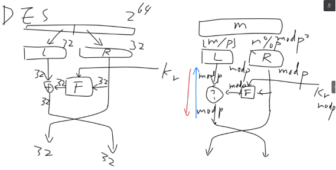
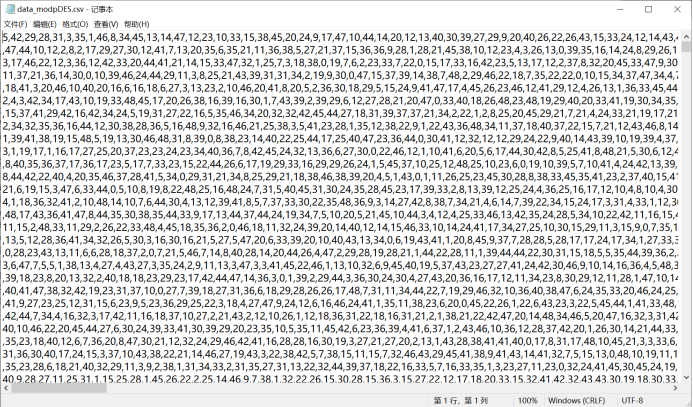
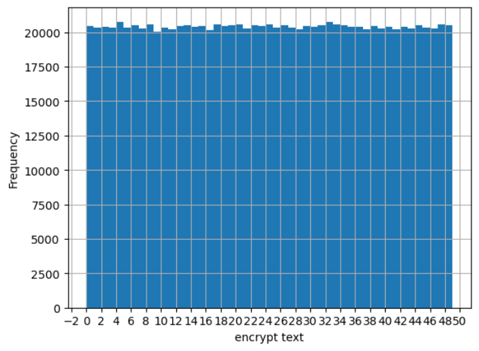
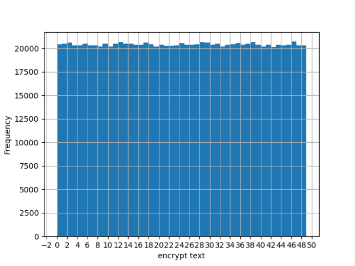

# mod_P_Feistel
An encryption/decryption algorithm with Feistel structure

defined in a Galois field (limited in the range of a certain prime P)

## 任务目标

设计并实现针对有限域的对称密码算法。要求在DES算法（Feistel结构算法）的基础上，把明文、密文、密钥的取值范围从‘任意64bit数据’改为‘从0到p2-1之间的整数’，其中p是一个小于232的素数（p2小于264）。

密文应在密文空间内均匀分布。

## 对DES算法的修改方案

与DES相比，现在明文、密文、密钥空间发生了变化，意味着算法面向的加密内容发生变化，原有的按位扩散混淆、置换、模2加等二进制下的概念均不再是应该考虑的实现方案。为了仍能沿用Feistel结构，需要考虑以下几个问题：

1. 不能使用面向二进制位的置换操作，则初始置换和结尾逆初始置换应该如何处理？
2. 如何将一个整数分为左半和右半？
3. 原有的轮函数输出与左半异或（模2加），从而实现可逆运算，现在应该采用何种可逆操作？

对于上述问题的解答思路如上图。

对问题1，DES中的初始置换和逆初始置换本来就确定是没有安全意义的，可以直接删除；

对问题2，明文m现在的范围是0到p2-1，即m< p2，因此必有m mod p < p；m / p < p。于是可以分别将m / p和m mod p作为左半和右半，从而使得二者均在mod p的范围内。加密迭代完成后，取L * p + R即可得到0到p2-1范围的密文。解密过程同理。

对问题3，现在L是mod p的数，如果轮函数输出也是mod p的数，则二者mod p相加就是一种理想的可逆操作：解密时只需mod p相减。

## 子密钥的产生

根据前一部分中的示意图，轮密钥应该也是mod p的数。考虑到轮密钥的值并不会影响算法能否正确加解密（只出现在轮函数中），因此这里也不再探求轮密钥生成的安全性问题，直接将原来DES中生成的16个轮密钥做mod p处理，便得到mod p范围的轮密钥，满足加解密的要求。

## 加密函数

分析Feistel结构可以知道，加密过程是否可逆仅仅取决于轮函数的输出与左半L进行的操作是否可逆。而对于轮函数的内容，在设计时完全不需要考虑其是否可逆，只需要有轮密钥的参与、对右半R产生某种作用即可。

最简单的思路自然是将轮密钥与R直接进行某个mod p的运算。考虑到轮密钥可能为0，模乘、模幂均是不合适的，前者使右半直接变为0，后者则变为1。因此模加应该是最简单易行的思路。

这里采用的轮函数形式如下：

F(Right，RoundKey) =( Right-1) * 常量 + RoundKey

也就是先将右半取模逆（引入非线性因素），再乘以某个常量，然后与轮密钥模加（引入密钥）。这种做法需要注意右半为0的情况，可以直接令求逆结果为0，然后加轮密钥。

## 密文分布情况测试

取一个较小的p为7，则p的平方为49。若随机生成明文和密钥，密文应该在0-48之间均匀分布。查看记录的情况如下：

在第3部分的（6）中，将明文改变一位时密文的变化数量记录结果保存在了data.csv中。查看其中内容如下：

 

为了能够验证其分布情况，使用Python中的matplotlib工具绘制频数直方图，结果如下：

 

可以看到，密文在0-48范围内的分布情况是相当均匀的；共1000000个密文，每个密文的出现次数都大约是1000000/49=20408次。

另外，这里尝试了把轮函数换为单纯的轮密钥模加，结果如下图：

 

因此，仅使用轮密钥模加的轮函数也是可以实现密文均匀分布的，但安全性较弱。
